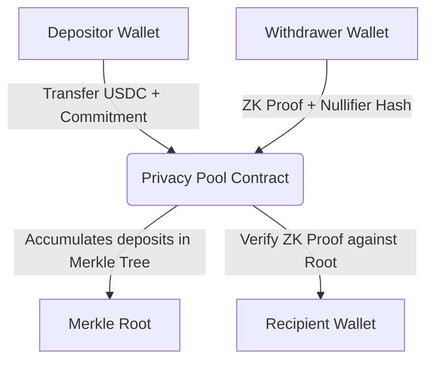

# StellApp ZK Privacy Systems Guide

StellApp implements two distinct Zero-Knowledge (ZK) privacy systems on the Stellar network:
1. **ZK Privacy Pool** (Shielded anonymity mixer)
2. **ZK Confidential Transfers** (Encrypted account balances)

This document explains their architecture, implementation details, and step-by-step instructions for debugging and database recovery.

---

## 1. ZK Privacy Pool (Shielded Mixer)

The Privacy Pool allows users to deposit funds (USDC) from one address, and withdraw them anonymously to a different address. It breaks the link between depositor and withdrawer using ZK-SNARKs (Groth16).



### The Merkle Tree (Depth 4)
* **Leaves**: The tree accommodates up to $2^4 = 16$ deposits. Each leaf is the hash of a secret and a nullifier: `commitment = Poseidon2(nullifier, secret)`.
* **Standard Hashing Order**: The WASM verifier circuit and on-chain contract expect `Poseidon2(left, right)` ordering. Because the `recomputeCommitment(secret, nullifier)` wrapper swaps inputs under the hood (mapping to `poseidon2(nullifier, secret)`), standard binary tree hashing must call `recomputeCommitment(right, left)` to compute `Poseidon2(left, right)`.

### The Lifecycle
1. **Deposit**:
   - The bot generates a random `secret` and `nullifier` off-chain.
   - It computes the leaf commitment: `commitmentHex = Poseidon2(nullifier, secret)`.
   - It submits the deposit to the contract on-chain.
   - It saves the deposit record to the `PrivacyDeposit` database table.
   - **Merkle Root Update**: Since only the administrator can write new roots to the contract, the bot queries the Admin user (`918137956320@c.us`), decrypts their key, and invokes `update_root` on-chain with the new root.
   - The bot outputs a secret note to the user: `stellapp-zk-v1_CONTRACT_AMOUNT_SECRET_NULLIFIER`.

2. **Withdrawal**:
   - The user provides the secret note and a recipient address.
   - The bot parses the note, calculates the deposit's `commitmentHex`, and queries the database for all deposits under that `contractId` to reconstruct the Merkle path.
   - The bot generates a Groth16 proof using the proving key (`withdraw.zkey`) and input variables (`secret`, `nullifier`, `pathElements`, `pathIndices`, `recipient`).
   - The bot submits the proof and the computed `nullifierHash` to the contract.
   - The contract verifies the proof against its active root, registers the nullifier as spent (preventing double-spend), and releases the USDC.

---

## 2. ZK Confidential Transfers (Encrypted Balances)

Confidential Transfers use homomorphic encryption to hide transaction amounts and account balances on-chain while verifying that the sender has sufficient funds.

* **Registration**: The user registers their public key in the contract to initialize a confidential account.
* **Wrap (Confidential Deposit)**: Converts public USDC into encrypted private balances.
* **Transfer**: Sends encrypted tokens to another registered user. Only the sender and recipient can decrypt the amount and their own balances.
* **Merge**: If a user receives multiple confidential transfers, they merge them to combine the encrypted balance payloads.
* **Unwrap (Confidential Withdraw)**: Converts encrypted private balances back into standard public USDC.

---

## 3. Troubleshooting & Database Recovery Playbook

If the local database is cleared, the bot loses the `PrivacyDeposit` records. This makes it impossible to reconstruct the Merkle path for withdrawals, leading to `Merkle root mismatch` or `Deposit not found` errors.

### A. Reconstructing the Database from Blockchain Events
To recover the deposits from the blockchain ledger:
1. Inspect the contract events on the Stellar Testnet Explorer.
2. Every deposit emits a `deposit` event containing the `commitment` and the `leaf_index`.
3. Re-insert these commitments into the `PrivacyDeposit` table in order of their `leafIndex` (from `0` upwards).
4. Run the database check script to verify:
   ```bash
   npx tsx scratch/check_latest_deposits.ts
   ```

### B. Mismatched Merkle Root Recovery
If the on-chain Merkle root lags behind the database (e.g., if a root update failed because of a non-admin deposit), the contract will reject withdrawals.
To force-align the on-chain Merkle root with the database state:
1. Open [scratch/update_onchain_root.ts](file:///Users/shijas/stellapp/scratch/update_onchain_root.ts).
2. Set the `contractId` and the `leafIndex` to the latest leaf index in the database.
3. Run the script:
   ```bash
   npx tsx scratch/update_onchain_root.ts
   ```
4. This will calculate the correct Merkle root including all deposits and write it directly to the blockchain contract using the Admin account.

---

## Useful Debugging Scripts (in `scratch/`)

* **[check_latest_deposits.ts](file:///Users/shijas/stellapp/scratch/check_latest_deposits.ts)**: Inspects the database tables to verify recent privacy deposits and active session states.
* **[test_merkle_path.ts](file:///Users/shijas/stellapp/scratch/test_merkle_path.ts)**: Reconstructs and verifies the Merkle root of the active contract using standard Poseidon tree rules.
* **[update_onchain_root.ts](file:///Users/shijas/stellapp/scratch/update_onchain_root.ts)**: Computes the correct Merkle root of all database deposits and updates the contract state using Admin keys.
