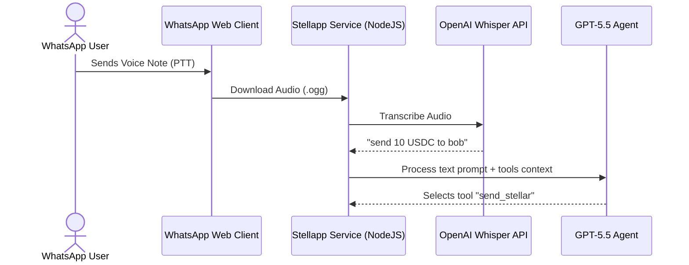
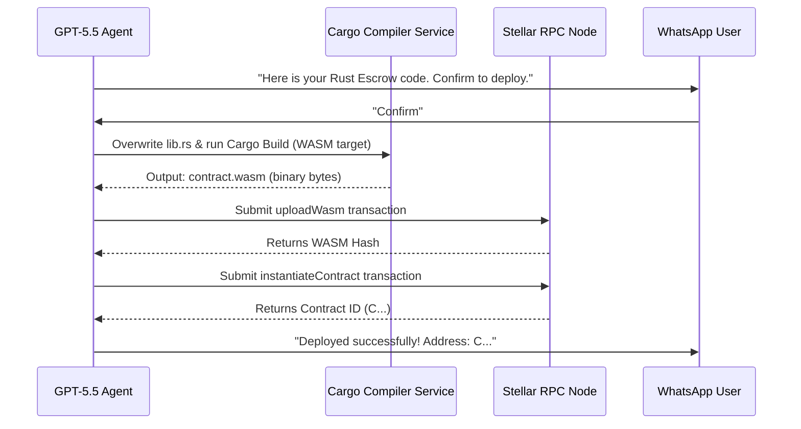

# 🌌 StellApp: The AI-Powered WhatsApp Wallet for Stellar

**StellApp** is a next-generation agentic gateway that brings the full power of the **Stellar & Soroban** blockchains directly to your WhatsApp chat. Using natural language (both text and push-to-talk voice notes), users can manage custodial wallets, swap assets on the SDEX, bridge USDC from EVM networks via Circle CCTP, deploy on-the-fly custom Rust smart contracts, and send funds directly to contact phone numbers or usernames.

---

## 🛠️ Key Features

*   🎤 **Multilingual Voice Notes (Whisper & TTS)**: Send commands as audio voice notes. The bot transcribes them, executes the action, and replies back with both text and voice.
*   🛠️ **On-The-Fly Rust Compiler & Deployer**: Describe any contract idea (e.g. payment splitters, vaults). The bot writes the Rust Soroban code, compiles it to WASM in seconds on the server, uploads it, and deploys it on-chain.
*   🔐 **Full Escrow Operations**: Deploy a template escrow vault, then release or refund the locked USDC tokens on-chain using Arbiter require-auth signatures.
*   🏷️ **Contact Sends & Pre-Created Wallets**: Send funds directly to phone numbers (e.g., \`+919876543210\`) or usernames. If the recipient hasn't joined the bot yet, it pre-creates, activates, and registers a USDC trustline for their wallet on-chain, ready to be claimed when they log in.
*   🔄 **USDC EVM-to-Stellar Bridge**: Send USDC from Base (Sepolia or Mainnet) and bridge it directly to Stellar using Circle CCTP, tracked by a background signature polling worker.

---

## 📐 Architecture & Flow

### 1. Inbound Request & Voice Processing Flow


### 2. Custom Smart Contract Compilation & Deployment Flow


---

## 📁 Repository Structure

```
stellapp/
├── prisma/                   # SQLite database configurations and schemas
│   ├── dev.db                # Active local database instance
│   └── schema.prisma         # User profiles & wallet tables
├── scratch/                  # Cargo compiler caching space
│   └── compiler/             # Pre-configured cargo workspace for Soroban SDK
├── src/
│   ├── agent/                # OpenAI agent loop, prompt guidance, and tool maps
│   │   ├── agent.ts
│   │   ├── prompt.ts
│   │   └── tools.ts
│   ├── bot/                  # WhatsApp Web client setup and message router
│   │   ├── controller.ts
│   │   └── whatsapp.ts
│   ├── services/             # Core blockchain services
│   │   ├── compiler.ts       # Rust compile commands execution
│   │   ├── config.ts         # Environment parameters
│   │   ├── encryption.ts     # AES-256 key encryption
│   │   ├── evm.ts            # Base EVM SDK helper methods
│   │   └── stellar.ts        # Stellar SDK transaction builders
│   └── index.ts              # Entry point
├── package.json              # Dependencies
└── tsconfig.json             # TypeScript rules
```

---

## 🚀 Setting Up Locally

### 📋 Prerequisites
1.  **NodeJS**: v18 or later.
2.  **Rust & Cargo**: Standard Rust toolchain installed.
3.  **WASM Target**: Add the WebAssembly target to cargo:
    ```bash
    rustup target add wasm32-unknown-unknown
    ```

### ⚙️ Installation
1.  Clone the repository and install npm packages:
    ```bash
    npm install
    ```
2.  Set up your environment variables in `.env` (using `.env.example` as a template):
    ```env
    OPENAI_API_KEY="sk-proj-..."
    ENCRYPTION_KEY="your-32-byte-hex-key"
    IS_MAINNET=false
    ```
3.  Deploy the database tables:
    ```bash
    npx prisma db push
    ```
4.  Run the development server:
    ```bash
    npm run dev
    ```
5.  Scan the displayed **QR Code** using WhatsApp -> Link a Device on your phone.
6.  Start texting your bot!

---

## 🛡️ Security Best Practices

1.  **AES-256 Custodial Encryption**: User seed phrases and private keys are never stored in plain text. They are encrypted using AES-256-GCM before writing to the database.
2.  **Zero-Inflation Issuer Locking**: Newly issued custom tokens permanently disable their master keys on-chain during the creation transaction to prevent unauthorized token dilution.
3.  **Soroban require_auth Checks**: Deployed Escrow vaults utilize strict Soroban authorization parameters to verify the Arbiter's cryptographic signature before releasing or refunding locked tokens.
